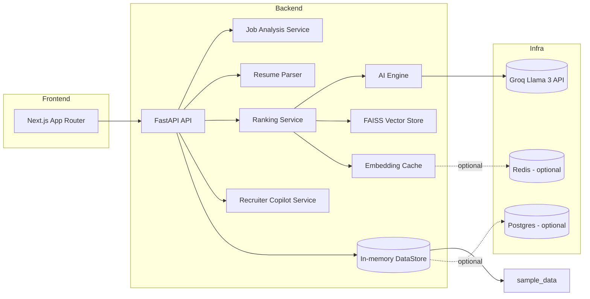
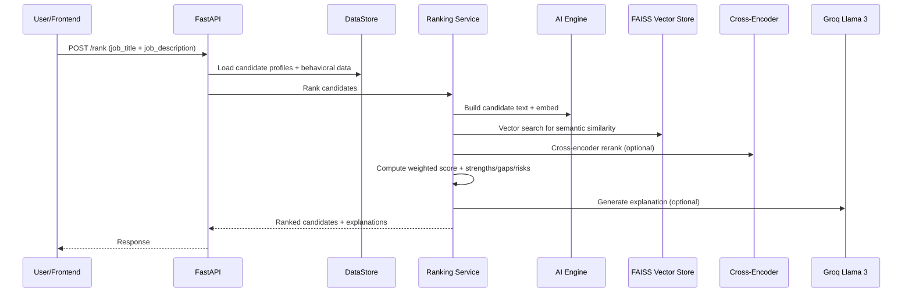

# TalentSync AI

TalentSync AI is an AI hiring intelligence platform that simulates elite recruiter reasoning. It goes beyond keyword matching by understanding job intent, evaluating semantic fit, inferring transferable skills, and producing explainable rankings with recruiter-style insights.

## Why it wins

- Ideal Candidate DNA from job descriptions (LLM-driven with a deterministic fallback).
- Multi-layer matching: semantic embeddings + cross-encoder rerank + domain and skill overlap.
- Behavioral signals and growth potential baked into ranking, not bolted on.
- Recruiter Copilot chat that shortlists candidates with human-readable rationale.
- Explainability for every candidate: strengths, gaps, transfers, and risk flags.

## System architecture



## Ranking data flow



## Core logic

### 1) Job understanding (Ideal Candidate DNA)

- Uses Groq Llama 3 to extract structured recruiter intent into a DNA schema.
- When GROQ is not configured, a deterministic regex-based extractor is used.

### 2) Resume parsing

- PDF, DOCX, and TXT are supported.
- Combines PyMuPDF, python-docx, spaCy NER, and regex section parsing.
- Extracts skills, bullets, entities, leadership/achievement signals.

### 3) Semantic intelligence

- Embeddings use sentence-transformers (default BAAI/bge-small-en-v1.5).
- FAISS IndexFlatIP is used for similarity search (normalized embeddings).
- If FAISS fails or is missing, dot-product similarity is used as fallback.
- Cross-encoder reranker refines relevance scores when available.

### 4) Ranking and scoring

- Scores blend semantic match, skill overlap, domain match, behavioral signals,
  learning velocity, and stability.
- Final score is a weighted sum using default weights in ranking_engine/weights.py.

Example scoring expression:

```
final_score = sum(scores[key] * weights[key] for key in weights)
```

Default weights:

- semantic_match: 0.35
- technical_fit: 0.20
- behavioral_score: 0.15
- learning_velocity: 0.10
- domain_match: 0.10
- stability_score: 0.10

### 5) Explainability layer

- Strengths, gaps, risk flags, and transferable skills are attached to every candidate.
- Groq generates recruiter-style explanations when available; otherwise a concise fallback is used.

### 6) Recruiter Copilot chat

- LLM turns conversational queries into shortlists with rationale.
- Falls back to top-ranked candidates if LLM is unavailable.

### 7) Caching and storage

- Embeddings are cached in-memory and optionally persisted in Redis.
- Demo path uses in-memory DataStore seeded from sample_data/.
- Database config exists for production but is not required for the demo flow.

## API surface

- GET /health: health check.
- POST /jobs/analyze: generate Ideal Candidate DNA.
- POST /candidates/parse: parse a resume file (pdf/docx/txt).
- GET /candidates: list candidates.
- GET /candidates/{id}: candidate details.
- GET /candidates/{id}/similar: similar candidates by embedding similarity.
- POST /rank: rank candidates for a job description.
- POST /chat: recruiter copilot query.
- POST /seed: reload demo data.

## Project structure

- frontend/: Next.js UI (dashboards, analytics, candidate views).
- backend/: FastAPI app and API routers.
- ai_engine/: job understanding, embeddings, reranking, explainability.
- ranking_engine/: weighted scoring logic.
- resume_parser/: document parsing and skill extraction.
- vector_store/: FAISS vector search and embedding cache.
- chat_assistant/: recruiter copilot orchestration.
- sample_data/: sample jobs and resumes.
- scripts/: seed script and demo helpers.

## Quick start

### Backend

1. Create a virtual environment and install dependencies:

```
python -m venv .venv
.venv\Scripts\activate
pip install -r backend/requirements.txt
```

2. Install spaCy model:

```
python -m spacy download en_core_web_sm
```

3. Create .env in backend/ with required variables.

4. Run the API:

```
uvicorn app.main:app --reload
```

### Frontend

1. Install dependencies:

```
cd frontend
npm install
```

2. Create frontend/.env.local and set NEXT_PUBLIC_API_URL.

3. Start the dev server:

```
npm run dev
```

### Optional infrastructure

Start Postgres and Redis locally:

```
docker compose up -d
```

## Configuration

Backend env vars (backend/.env):

- GROQ_API_KEY: API key for Groq.
- GROQ_MODEL: defaults to llama3-70b-8192.
- DATABASE_URL: defaults to sqlite+aiosqlite:///./talentsync.db.
- REDIS_URL: optional, enables embedding cache persistence.
- EMBEDDING_MODEL: defaults to BAAI/bge-small-en-v1.5.
- RERANK_MODEL: defaults to cross-encoder/ms-marco-MiniLM-L-6-v2.

Frontend env vars (frontend/.env.local):

- NEXT_PUBLIC_API_URL: FastAPI base URL.

## Demo workflow

1. POST /seed or run scripts/seed_demo.py.
2. POST /jobs/analyze with a job description.
3. POST /rank to get explainable candidate rankings.
4. POST /chat for recruiter-style queries and shortlists.

## Notes and limitations

- Demo uses in-memory DataStore; sample_data/ is reloaded at startup.
- FAISS is optional; if unavailable, semantic scores fall back to dot-product.
- Groq is optional; deterministic fallbacks keep the demo functional.
